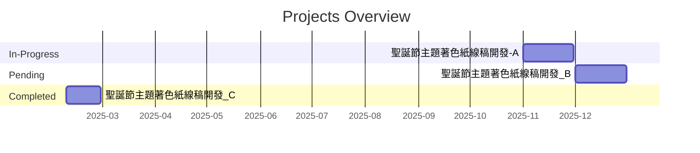

# 王小美 - 工作清單與進度報告

- 組織: 三腳貓產品開發處-三腳貓跑步算法開發部
- 職位: 軟韌體工程師

---

<!-- AUTO_UPDATE_START -->

### In-Progress Projects
- [2025-11-01-bug 聖誕節主題著色紙線稿開發-A 耶誕專案 40% 20d](../projects/2025-11-01-bug.md)
    * **2025-11-05:** 專案啟動，確定了畫風和主要素材清單。
    * **2025-11-12:** 完成了前 5 張草圖，並與李曉華組長進行了第一次審核。下週將專注於後續 5 張線稿的細節優化。

### Pending Projects
- [2025-05-01-research 聖誕節主題著色紙線稿開發_B 耶誕專案 0% 23d](../projects/2025-05-01-research.md)

### Completed Projects
- [2025-02-01-dev 聖誕節主題著色紙線稿開發_C 耶誕專案 100% 15d](../projects/2025-02-01-dev.md)

<!-- AUTO_UPDATE_END -->